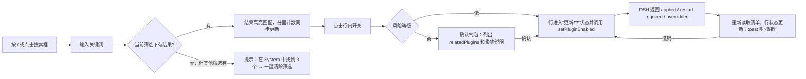
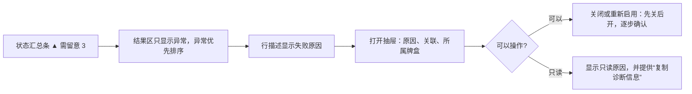
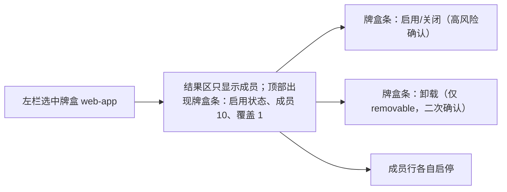

# Aster 插件管理与主流程优化建议

> 依据：[01-evaluation.md](01-evaluation.md)。约束：不重新设计插件底层架构；以现有 DSH 接口为主（`pluginInventory/list`、`pluginManager/listPlugins|listBundles|setPluginEnabled|setBundleEnabled|inspect|installBundle|removeBundle`）；需要后端配合的部分统一标注为 **【需后端】**。

## 1. 设计原则

1. **一个页面两种目的**：浏览靠美术（塔罗牌），管理靠扫读（清单）。两者共用同一套筛选状态，只切换视图，不拆成两个页面。
2. **状态先于装饰**：开、关、异常、等待、只读这五种状态，在任何视图中都要在 1 秒内分辨出来，不能只靠 11px 文字。
3. **维度正交**：职责（Core/System/Feature/待分类）和来源（用户加装/内置可选/Profile 依赖/DSH 提供）是两个维度，分成两组筛选，不再并排成一排标签。
4. **就地操作，按风险升级确认**：低风险操作在行内完成；高风险操作（Core、有存活关联的插件、牌盒、卸载）弹出确认并列出影响范围；成功后可以撤销。
5. **不做乐观更新**：沿用现有“DSH 确认后再刷新”的权威模型。行内开关在请求期间显示“更新中”，不提前翻转。

## 2. 推荐页面布局

### 2.1 桌面（窗口宽 ≥ 1100px，默认桌面窗口 1280×733）

```
┌──────────────────────────────────────────────────────────────────────────────────┐
│ 插件 · The Atelier            [🔍 搜索名称、能力、ID…   /]    [↻ 刷新] [+ 添加牌盒] │  ← 单行页头（约 56px）
├──────────────────────────────────────────────────────────────────────────────────┤
│ 72 个插件   ● 运行中 58   ○ 已关闭 9   ◐ 等待 2   ▲ 需留意 3   🔒 只读 21          │  ← 状态汇总条（每项可点，作为状态筛选）
├───────────────────┬──────────────────────────────────────────────────────────────┤
│ 视图               │ 已筛选：[Feature ×] [已关闭 ×]  清除全部        排序[名称▾] [☰|▦] │
│  全部        72    │──────────────────────────────────────────────────────────────│
│  ⌑ 收藏       4    │ ▸ Feature · 功能插件  (5)                                     │
│  ▲ 需留意     3    │ ┃● Tool Fs        读写工作区文件…      Profile 依赖  ✴2  [━●] › │
│                   │ ┃○ Office To Pdf   将 Office 文档转为…  内置可选          [●━] › │
│ 职责               │ ┃▲ Web Search      连接失败 · 查看原因  Profile 依赖      [━●] › │
│  ■ Core      10    │ ▸ System · 系统内部  (3)                                      │
│  ■ System    30    │ ┃🔒 Api Session…   会话控制器          DSH 提供   受保护  ─   › │
│  ■ Feature   28    │ …                                                             │
│  □ 待分类     4    │                                                              │
│ 来源               │                                                              │
│  用户加装     3    │                                                              │
│  内置可选    10    │                                                              │
│ 牌盒               │                                                              │
│  base        20    │                                                              │
│  web-app     10    │                                                              │
│  acme-conn…   3    │                                                              │
│ 作用范围           │                                                              │
│  (•) Host          │                                                              │
│  ( ) Agent·Standard│                                                              │
└───────────────────┴──────────────────────────────────────────────────────────────┘
                                            ┌───────── 右侧抽屉 420px ─────────┐
  点击行 “›” 或行本身 → 抽屉滑入，列表保持可见   │ ‹ 返回 Web Search   面包屑        │
                                            │ [牌面缩略图] Web Search            │
                                            │ ▲ 需留意 · Feature · Profile 依赖  │
                                            │ [━● 已启用]  [⌑ 收藏]              │
                                            │ ── 原因 ───────────────────────    │
                                            │ error.diagnostic / fiberPhase 说明 │
                                            │ ── 关联 (2) ───────────────────    │
                                            │ ✴ Web Fetch Http  services: web    │
                                            │ ── 所属牌盒 ───────────────────    │
                                            │ ▸ 技术信息（Module/Entry/Profile row）│
                                            └───────────────────────────────────┘
```

**要点**

| 区域 | 规格 | 现有数据来源 |
| --- | --- | --- |
| 单行页头 | 插件页不使用 `pageHeader()` 的大标题和副标题（`app.js:38`），标题、搜索、刷新、添加牌盒合并为一行；桌面版去掉 “Back to your thoughts”，因为已有邮票返回 | — |
| 状态汇总条 | 统计当前**作用范围**下的状态分布（不受其他筛选影响），点击某项即设置状态筛选，再点取消。数量为 0 的项隐藏，“需留意”大于 0 时使用警示色 | `status()`、`matchesState()`（`plugin-library.js:78-85,120-129`） |
| 左栏：视图 | 全部 / 收藏 / 需留意，作为快捷入口 | 现有收藏、`attention` 筛选 |
| 左栏：职责 | 多选。计数为**分面计数**：应用其他所有筛选和搜索后，该职责下的结果数 | `classify().role` |
| 左栏：来源 | 多选。原 Extension 标签移到这里（“用户加装”“内置可选”）；卡片颜色只跟职责走，不再被来源覆盖 | `classify().origin` |
| 左栏：牌盒 | 单选。选中后结果区只显示该牌盒的成员，结果区顶部出现牌盒操作条（启用/关闭/卸载/成员数/覆盖数）。取代独立的 Boxes 标签 | `bundlesFor()`、`bundle.rows/overrides` |
| 左栏：作用范围 | Host 或各 Agent 预设（原下拉框）。选中预设时，页面顶部显示“预设条目只读”横条 | `scopedRows()` |
| 结果区 | 默认**清单视图**，按职责分组，组头可折叠，显示组计数；排序支持名称、状态（异常优先）、职责、来源 | — |
| 清单行 | 左侧 4px 职责色条、状态图标、名称（高亮匹配）、一行描述或失败原因、来源标签、关联数 ✴n、行内开关、› 打开详情。行高 44–52px，一屏约 10–12 行 | 现有字段 |
| 卡牌视图 | 保留现有塔罗卡，但：①卡面右上角加状态徽标；②failed 卡加红色边角；③关闭卡的插画降低饱和度并加“已关闭”纸签；④标题行只保留名称和状态，去掉重复的分类文字和每张卡的提示；⑤每页数量取列数的整数倍（例如 5 列 × 4 行 = 20） | 现有 `face()`/`card()` |
| 右侧抽屉 | 宽 420px，不遮挡列表；Esc 或 × 关闭；内部导航（关联、牌盒成员）进入返回栈，顶部显示“‹ 返回 X” | 现有 `open()`/`relation()` 内容迁移 |

### 2.2 窄窗口（< 1100px）与移动端

- 左栏收起为顶部“筛选”按钮，点击后从左侧弹出抽屉；已选筛选以可删除的标签显示在搜索框下方。
- 详情抽屉改为全屏面板（保留返回栈）。
- 汇总条允许横向滚动。

### 2.3 与视觉风格的衔接

- 清单视图使用纸面行：细横线分隔，职责色条模拟“书签丝带”，状态图标沿用现有 ✦ 系列符号的简化版，不引入第二套图标。
- 开关沿用现有 `.switch`（`style.css`，以 `aria-checked` 驱动的纸质开关），不新建组件。
- 卡牌视图继续作为“收藏册”体验：切换到卡牌视图时，可保留一次性翻牌入场（≤ 300ms，遵守减弱动效）。

## 3. 状态展示规范

| 状态 | 判定（沿用 `status()`） | 图标 / 颜色 | 清单行 | 卡牌 |
| --- | --- | --- | --- | --- |
| 运行中 | `enabled === true && fiberPhase === 'active'` | ● 绿 `#3f7a55` | 正常 | 正面；右上角绿点 |
| 已启用（未挂载） | `enabled === true` 且无 phase | ● 浅绿空心 | 正常 | 同上 |
| 等待 | `fiberPhase === 'pending'` | ◐ 琥珀 | 描述行显示“等待依赖” | 琥珀徽标 |
| 启动中 / 停止中 | `loading` / `unloading` | ◌ 旋转（减弱动效时静态） | 开关禁用 | 同 |
| 已关闭 | `enabled === false` | ○ 灰 | 名称降为次要色 | 插画去饱和，加“已关闭”纸签 |
| 条件启用 | `enabled === 'conditional'` | ◇ 紫灰 | 开关位置显示“由预设条件决定” | 同 |
| 需留意 | `error` 或 `failed` | ▲ 红 `#a2473f` | 描述行替换为失败原因（有 `error.diagnostic` 时显示） | 红色边角 |
| 只读 | `controlReason()` 非空 | 🔒 或纸夹符号 | 开关位置显示“受保护”，悬停或聚焦时显示原因 | 标题行显示小锁 |

- 所有状态文字统一为中文，英文仅作装饰（例如卡面丝带）。
- 颜色不能作为唯一区分手段：每个状态同时有形状和文字。
- 文本对比度提高到 ≥ 4.5:1：把 01 第 P2-4 节列出的颜色统一加深到约 `#6f6450`。

## 4. 关键操作流程

### 4.1 查找并启停（最高频）



- **风险等级（前端即可判定）**：高风险指 `role === 'core'`，或存在 `relatedPlugins` 的插件在“关闭”方向，或牌盒启停；低风险指其余情况。
- **撤销**：对同一条目反向调用 `setPluginEnabled`，同样串行且需要 DSH 确认，不做本地回滚。toast 保留 8s，撤销按钮必须可以用键盘聚焦。
- **restart-required / overridden**：行内显示持久提示“已保存，需重启 DSH”或“已保存，但被其他配置覆盖”，不能只在 toast 里闪过。

### 4.2 排查异常



- “复制诊断信息”把 Module、Entry、Profile row、fiberPhase、error 拼成文本，方便贴给开发者。
- “重新加载单个插件”需要后端提供 reload 接口 **【需后端】**；在此之前，只提供“先关后开”的组合操作，并明确说明它会对 DSH 做两次写入。

### 4.3 按牌盒管理



- 牌盒条说明文案沿用现有语义：“关闭牌盒会移除它的配置层，不会强制关闭所有成员。”
- 卡牌视图下，牌盒仍可显示为“盒子”封面，作为结果区第一张卡。

### 4.4 添加牌盒（沿用现有流程，只做文案与一致性调整）

现有流程“输入来源 → inspect → 确认 → 安装进度 → 结果（含构建脚本审批）”已经完整（`app.js:221-294`）。只需：统一为中文文案；安装成功后自动在左栏选中新牌盒并高亮成员。

### 4.5 批量操作（可选）

- 清单视图支持多选（行首复选框，Shift 连选）后“启用所选 / 关闭所选”。
- 现有接口只能串行逐个调用 `setPluginEnabled`，**不是事务**：中途失败时会部分生效。前端可以实现，但必须逐条显示结果，并在失败时停止。
- 要做到原子批量需要批量接口 **【需后端】**。建议放在第三阶段，并视反馈决定是否实施。

## 5. 主流程修复建议

| # | 问题 | 建议 |
| --- | --- | --- |
| M1 | 草稿丢失 | `renderPage()` 离开首页前把 `#message-input` 的值保存到内存（按 `currentChat` 分键），`initHome()` 时恢复；切换会话或新建对话时清空对应键 |
| M2 | 转场丢点击 | `navigate()` 在 `transitioning` 期间记下“最后一次目标”，转场结束后跳转过去（只保留最后一次），不再直接 `return` |
| M3 | 非首页不显示连接状态 | 在导航区域（例如邮票旁）放一个常驻的小连接指示器，断线时所有页面都能看到并可点击重连 |
| M4 | Toast | 分为 `info` 和 `error` 两级：error 使用 `role="alert"`，不自动消失或延长到 8s；支持一个动作按钮（撤销/查看/重试）；最多堆叠 3 条 |
| M5 | 开信 3.2s | 动画进行中再次点击或按 Esc/Enter 直接跳到终态（复用 `reduced` 分支的终态逻辑）；设置中增加“快速打开信封” |
| M6 | 导航可发现性 | 标签改为“功能名 + 隐喻名”（例如“插件 · The atelier”）；悬停标签放在不遮挡内容的位置（星星左侧，最大宽度受限），键盘聚焦时同样显示 |
| M7 | 中英混排 | 功能性文案（按钮、状态、toast、错误）统一中文，英文只用于装饰标题；集中成一个文案表，后续做 i18n 时可以直接替换 |
| M8 | 邮票素材 | 发布前确认 `paramont-logo-original.png` 的授权；如有疑问，换成 Aster 自有星形邮票 |
| M9 | 描述只取英文 | `localizedPluginText` 按 `navigator.language` 或设置优先取 `zh`，没有再取 `en` |
| M10 | 双层框 | 桌面模式（`.aster-desktop`）下，插件、设置等子页去掉内层面板背景和返回链接，内容直接排在信纸上 |
| M11 | 空状态文案 | 区分“还没有会话”和“没有匹配的会话” |
| M12 | 加载会话无反馈 | 被点击的明信片或条目显示加载态；重复点击给出提示 |

## 6. 动效规范（插件页）

| 场景 | 时长 | 缓动 | 减弱动效 |
| --- | --- | --- | --- |
| 抽屉滑入 / 滑出 | 200ms / 160ms | `cubic-bezier(.2,.8,.2,1)` | 改为 0ms 淡入 |
| 行内开关切换（DSH 确认后） | 160ms | ease-out | 瞬时 |
| 卡牌状态变更翻牌（现有） | 340ms | ease-out | 已处理，保留 |
| 筛选结果变化 | 不做逐项动画，只做 120ms 整体淡入 | — | 瞬时 |
| 汇总条数字变化 | 不做数字滚动 | — | — |

原则：插件页的动画都不能阻塞下一次输入；动画进行中允许任何点击和按键。

## 7. 需要后端配合的部分（单独列出）

| # | 需求 | 用途 | 没有时前端怎么处理 |
| --- | --- | --- | --- |
| B1 | 插件分类元数据（例如 `meta.category` 或 inventory 中的 `role`） | 替换 `plugin-library.js:11-25` 的硬编码表 | 继续使用硬编码表，Unclassified 兜底 |
| B2 | `failed` 时的诊断信息（`error.diagnostic` 或 `lastError`） | 异常排查流程中的“原因” | 显示“DSH 未提供失败原因”，并提供复制诊断信息 |
| B3 | 本地化的 `meta.title/description`（zh） | 中文搜索与展示 | 显示英文，并在搜索中同时匹配模块名 |
| B4 | 单插件 reload/restart 接口 | 一键重试 | 只提供“先关后开”的组合操作 |
| B5 | 批量 `setPluginsEnabled`（事务） | 原子批量操作 | 串行调用，逐条显示结果，失败即停 |
| B6 | 静态依赖方向和关闭影响分析 | 高风险确认里“会影响哪些功能” | 使用现有 `relatedPlugins`（存活关联、无方向），并明确说明“仅显示当前已解析的关联” |
| B7 | Agent 预设条目的可写接口 | 预设范围内启停 | 保持只读并说明原因（现状） |
| B8 | 插件提供的工具和命令清单 | 按“能力”搜索（例如搜“grep”找到提供它的插件） | 只按名称、描述、ID 搜索 |

## 8. 明确不做

- 不改变 DSH 权威模型，不做乐观更新，也不在本地缓存插件状态作为真值。
- 不新增插件运行时、配置 schema 编辑器、资源占用统计（现有 README 已说明没有可信数据）。
- 不引入前端框架；在现有原生 JS 结构内完成。
