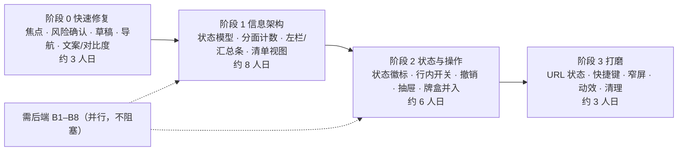

# Aster 插件管理与主流程优化：实施计划

> 依据：[01-evaluation.md](01-evaluation.md)、[02-optimization-proposal.md](02-optimization-proposal.md)。
> 基线：`codex/0928` @ `b41be04`。工期为单人估算（人日，含自测），供排期参考。
> 约束：不引入框架；DSH 仍是状态权威；**【需后端】** 项不阻塞前端各阶段。

## 0. 总览

| 阶段 | 目标 | 估算 | 可独立发布 |
| --- | --- | --- | --- |
| 0 | 修复已实测的交互缺陷，不改变布局 | 2.5–3 人日 | 是 |
| 1 | 插件页信息架构：左栏分面、汇总条、清单视图 | 7–8 人日 | 是（卡牌视图保留为可选） |
| 2 | 状态可读性与就地操作：徽标、行内开关、抽屉 | 5–6 人日 | 是 |
| 3 | 深链、键盘、窄屏、动效与清理 | 3 人日 | 是 |
| 后端 | B1–B8 按需对接 | 取决于 DSH | 各自独立 |

---

## 阶段 0：快速修复（先做，风险最低）

| # | 任务 | 文件 / 位置 | 做法 | 验收 |
| --- | --- | --- | --- | --- |
| 0.1 | 启停后恢复焦点 | `app.js:316-343`、`plugin-library.js:239-257` | 请求期间对按钮使用 `aria-disabled="true"` 并拦截点击，不再设置 `disabled`，这样焦点留在按钮上；`pin()` 改为走 `syncDetail()` 的焦点恢复路径 | 键盘启停或收藏后，`document.activeElement` 仍是详情里对应的按钮；Esc 后回到原卡片 |
| 0.2 | 高风险启停确认 | `app.js:316` 前加一个确认步骤；判定逻辑放在 `plugin-library.js` | 关闭 `role === 'core'` 的插件、关闭存在 `relatedPlugins` 的插件、启停牌盒时，先弹出确认，列出关联名称与 `reason` | 关闭 Core 必须经过二次确认；低风险插件一步完成 |
| 0.3 | 首页草稿保留 | `app.js:41`（`renderPage`）、`app.js:42`（`initHome`）、`app.js:114`（`newChat`）、`app.js:116`（`loadBackendSession`） | 使用内存 `Map<chatId, draft>`：离开首页时保存，`initHome` 时恢复，新建或切换会话时清空对应键 | 输入 → 去 Memories → 回首页，文本仍在；新建对话后为空 |
| 0.4 | 转场期间点击不丢失 | `app.js:39` | `transitioning` 期间记录 `queuedPage`，转场结束后若有则跳转过去（只保留最后一次） | 在 200ms 内依次点 Atelier、Settings，最终停在 Settings |
| 0.5 | 插件页文案统一中文 | `plugin-library.js:120-129`、`app.js:221-343` 中的 toast 与按钮 | 状态、按钮、toast 改为中文；英文只保留在装饰性标题 | 插件页和插件对话框中没有英文功能性文案 |
| 0.6 | 对比度 | `plugin-library.css:36,38,63,70,118` | 统一加深到对比度 ≥ 4.5:1（约 `#6f6450`） | 用 01 第 P2-4 节的方法重算，全部 ≥ 4.5 |
| 0.7 | 描述优先取中文 | `app.js:189` | `localizedPluginText` 按语言偏好优先取 `zh` | 带 `{en, zh}` 的 meta 显示中文 |
| 0.8 | Memories 空状态文案 | `app.js:143` | 区分“还没有会话”和“没有匹配的会话” | 两种情况分别显示对应文案 |

**测试**：扩展 `script/verify_plugin_library.cjs`，新增三类断言：Core 关闭必须先确认；启停完成后焦点仍在按钮上；`localizedPluginText` 优先取 zh。0.3 和 0.4 用浏览器冒烟验证（见“验证方式”）。

---

## 阶段 1：信息架构（左栏分面 + 汇总条 + 清单视图）

### 1.1 状态模型（先做，其余任务都依赖它）

在 `backendState`（`app.js:12`）中调整插件相关字段：

| 字段 | 取代 | 说明 |
| --- | --- | --- |
| `pluginView: 'list' \| 'cards'` | — | 默认 `list`；用户选择持久化到 `data.settings` |
| `pluginRoles: Set` | `pluginCategory` | 多选；空集表示全部 |
| `pluginSources: Set` | Extension 标签 | `added` / `optional` / `profile` / `provided` / `unknown` |
| `pluginBundle: string \| null` | `pluginTab === 'bundles'` | 选中牌盒时按成员过滤 |
| `pluginSort` | — | `name` / `status` / `role` / `source` |
| `pluginState`、`pluginScope`、`pluginSearch`、`pluginFavoritesOnly` | 保留 | — |

在 `plugin-library.js` 的纯函数区（第一个 IIFE，便于用 vm 测试）新增：

- `filterRows(rows, criteria, ctx)`：统一执行所有筛选，替代 `render()` 第 166-167 行的内联逻辑。
- `facetCounts(rows, criteria, ctx)`：计算每个分面取值在“其余筛选都生效”时的命中数。
- `statusSummary(rows, ctx)`：生成汇总条的数据。
- `searchMatches(item, query)`：返回命中字段和区间，用于高亮；中文和英文字段都参与匹配。

**验收**：`verify_plugin_library.cjs` 增加以下断言：分面计数与实际结果一致；Extension 不再与职责计数重叠（各职责计数之和等于总数）；搜索命中数在其他分类中时返回提示数据。

### 1.2 页面骨架

- **文件**：`plugin-library.js` 的 `render()`，以及 `plugin-library.css`。
- **结构**：页头单行（标题、搜索、刷新、添加牌盒）→ 汇总条 → 两栏（左栏 220px，右侧结果区）。
- **局部更新**：把整页 `innerHTML` 拆成三个挂载点，分别是 `#plugin-rail`、`#plugin-summary`、`#plugin-results`。搜索输入时只更新结果区和计数，搜索框本身不再被重建。这样可以删掉 `render()` 第 157、184-187 行和 `app.js:473-476` 的焦点与选区恢复补丁。
- **桌面模式**（`.aster-desktop`）：插件页不使用 `pageHeader()`，也不显示内层面板背景。
- **验收**：在 1280×733 桌面版窗口中，首屏至少能看到 8 行完整的清单行；输入搜索时输入框的 DOM 节点不被替换。

### 1.3 清单视图

- **行结构**：见 02 第 2.1 节。行本身是打开详情的按钮，开关是独立控件，两者都能用 Tab 聚焦。
- **分组**：按职责分组，组头可折叠，折叠状态放在内存中。
- **分页**：清单视图不分页，因为 DSH 插件规模在百级以内 `[INFERENCE]`，并且只渲染文本行；卡牌视图的每页数量改为列数 × 4（在 `ResizeObserver` 回调中读取列数）。
- **排序**：选择“状态”排序时，按“需留意 → 等待 → 启动中 → 运行中 → 已关闭”排列。
- **跨分类提示**：当前筛选结果为 0，而去掉职责、来源或牌盒筛选后有结果时，显示“在其他分类中找到 N 个 → 清除筛选”。
- **验收**：mock 数据下，“Core + tool” 场景出现跨分类提示；按状态排序时，failed 条目排在最前。

---

## 阶段 2：状态可读性与就地操作

| # | 任务 | 文件 | 验收 |
| --- | --- | --- | --- |
| 2.1 | 卡牌状态徽标 | `plugin-library.js:131-151`、`plugin-library.css` | 卡面右上角显示状态徽标；failed 卡有红色边角；关闭卡的插画去饱和并加“已关闭”纸签；标题行去掉重复的分类文字和每张卡的提示 |
| 2.2 | 行内开关 | 新增在清单行；调用现有 `toggleBackendPlugin`（`app.js:316`），并改为接收 `(kind, id)` 而不是按钮元素 | 低风险一步完成；高风险复用 0.2 的确认；请求期间行显示“更新中”；其他行的开关在此期间只读（沿用现有串行语义） |
| 2.3 | 撤销 | `app.js:34`（`toast` 支持动作按钮与 error 级别） | 成功 toast 保留 8s 并带“撤销”；撤销走同一条 DSH 确认路径；error 级别使用 `role="alert"` |
| 2.4 | restart-required / overridden 持久提示 | `backendState.pluginFeedback`（已有）渲染到行与抽屉 | 刷新后提示仍然可见，直到 DSH 的状态发生变化 |
| 2.5 | 详情抽屉 | 把 `plugin-library.js:217-238` 的内容迁移到非模态的 `<aside>`；`openDialog` 只保留给安装、卸载和确认 | 打开详情后列表仍可滚动和点击；Esc 关闭抽屉并把焦点还给来源行 |
| 2.6 | 返回栈 | 抽屉内部维护 `stack: Array<{kind,id}>` | 依次打开 A → 关联 B → 牌盒 C，可以逐级返回到 A |
| 2.7 | 牌盒并入左栏 | 删除 Cards/Boxes 标签（`plugin-library.js:177` 中 `data-backend-plugin-tab` 部分），以及 `app.js:425,497` 中对应的处理 | 左栏选中牌盒后，结果区只显示成员，并出现牌盒操作条；卸载仍走现有 `openBackendBundleRemoval` |

**测试**：vm 断言覆盖返回栈的入栈与出栈、`pluginFeedback` 在刷新后仍保留、牌盒过滤结果与 `bundlesFor` 一致。浏览器冒烟覆盖行内开关、确认、撤销的完整流程。

---

## 阶段 3：打磨与清理

| # | 任务 | 说明 |
| --- | --- | --- |
| 3.1 | URL 状态 | `#plugins?view=list&role=feature&state=attention&q=web&item=<entryId>`；`app.js:483` 的 popstate 处理和 `app.js:484` 的初始路由都要解析查询部分；只在用户操作时 `replaceState`，不在每次按键时 `pushState` |
| 3.2 | 快捷键 | `/` 聚焦搜索；在搜索框内按 Esc 清空；清单中 ↑/↓ 移动，Enter 打开，Space 切换开关 |
| 3.3 | 窄屏 | 左栏折叠为“筛选”抽屉；详情改为全屏面板 |
| 3.4 | 动效 | 按 02 第 6 节实现；所有新增动画都要处理 `.reduce-motion` 和 `prefers-reduced-motion` |
| 3.5 | 主流程剩余项 | M3 常驻连接指示器；M5 开信动画可跳过（再次点击或 Esc 直接到终态）；M6 导航标签改为“功能名 · 隐喻名”并避开内容；M10 桌面子页去掉双层框 |
| 3.6 | 清理 | 删除 `backendPluginStatus`（`app.js:210`）、`expandedBundles` 与 `[data-backend-bundle]`（`app.js:12,433`）、`style.css` 中已不再使用的 12 个 `dsh-plugin-*` 类；离线演示的插件页（`app.js:19-31,344-354,442-444`）改为复用新的清单和卡牌渲染，数据换成 mock inventory，从而去掉第二套 UI |
| 3.7 | 文档 | 更新 `dist/plugin-library.README.md` 中的交互说明；`README.md` 中 “Included” 一节同步修改 |

---

## 需后端配合（并行推进，不阻塞前端）

| # | 接口 / 字段 | 前端对接点 | 前置条件 |
| --- | --- | --- | --- |
| B1 | inventory 条目增加 `role`（或 `meta.category`） | `plugin-library.js:14-25` 的 `role()`：优先读取后端值，没有时回退到硬编码表 | DSH `plugin-inventory` 类型扩展 |
| B2 | failed 条目提供 `error.diagnostic` 或 `lastError` | 行描述、抽屉的“原因”区块 | DSH Loader 暴露 fiber 失败原因 |
| B3 | `meta.title/description` 提供 zh | 0.7 已支持读取 | 插件包的 locale 数据 |
| B4 | `pluginManager/reloadPlugin` | 抽屉中的“重新加载” | 新 RPC |
| B5 | `pluginManager/setPluginsEnabled`（事务批量） | 4.5 批量操作 | 新 RPC；在此之前批量操作不上线，或者串行调用并失败即停 |
| B6 | 静态依赖方向与关闭影响 | 0.2 的确认弹窗补充“将受影响” | 新 RPC 或 inventory 字段 |
| B7 | 预设条目可写 | Agent 作用范围下的开关 | 现有 `setPluginEnabled` 无法可靠持久化预设条目（见 `plugin-library.README.md`） |
| B8 | 插件提供的 tools 和 commands 清单 | `searchMatches` 增加 capability 字段 | inventory 字段扩展 |

建议优先级：**B2 > B1 > B3 > B6 > B4 > B8 > B5 > B7**。B2 直接决定异常排查流程是否闭环；B1 消除前端维护负担。

---

## 验证方式

1. **隔离回归**：`node script/verify_plugin_library.cjs`（现有测试，每个阶段都扩展）。新增的纯函数（`filterRows`、`facetCounts`、`statusSummary`、`searchMatches`）都放在 `AsterPluginLibrary` 中，可以在 vm 里直接测试。
2. **浏览器冒烟**：本次评估使用了一次性 mock 后端（72 插件 / 3 牌盒 / 1 预设，包含 failed、pending、只读和关联）。建议把它固化为 `script/mock-dsh-backend.js`，用法是 `python3 script/prepare_web.py <tmp>/Resources/Web` 之后，把该文件覆盖到 `aster-backend.js` 再起静态服务。这样每个阶段都可以在无 DSH 的环境里完成截图和交互冒烟。它只用于开发，不进入打包产物。
3. **真实 Host**：每个阶段结束后，用 `./script/build_and_run.sh` 连接真实 DSH 验证一次启停、牌盒启停、卸载，以及 `restart-required` 提示，并在 WKWebView 中复查动效与焦点（本次评估只在 Chromium 中完成）。
4. **可访问性**：键盘走完完整流程（搜索 → 选中 → 启停 → 撤销 → 打开详情 → 关联 → 返回 → 关闭），全程焦点可见且不丢失；对比度按 01 第 P2-4 节的方法复算。

## 风险与应对

| 风险 | 应对 |
| --- | --- |
| 行内开关让误操作更容易 | 0.2 的风险分级确认先上线；撤销与 toast 在阶段 2 同步交付 |
| 局部更新改造触及焦点与刷新合并的既有逻辑 | 先补 vm 测试再重构；保留 `fetchInventory` 的合并与 `pluginRequest` 版本号机制不动 |
| 视觉风格被清单视图“稀释” | 清单行沿用纸面、丝带色条和现有 ✦ 符号；卡牌视图保留并可切换；阶段 1 结束时做一次视觉评审 |
| WKWebView 与 Chromium 差异（`<dialog>`、`inert`、`ResizeObserver`） | 真实 Host 验证放在每个阶段的出口条件里 |
| 分类硬编码表在后端补齐前继续漂移 | B1 对接前，Unclassified 分组显示“向 DSH 反馈分类”说明，不自动猜测 |
